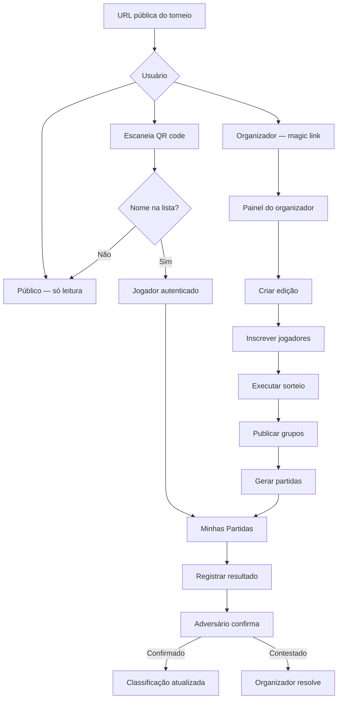
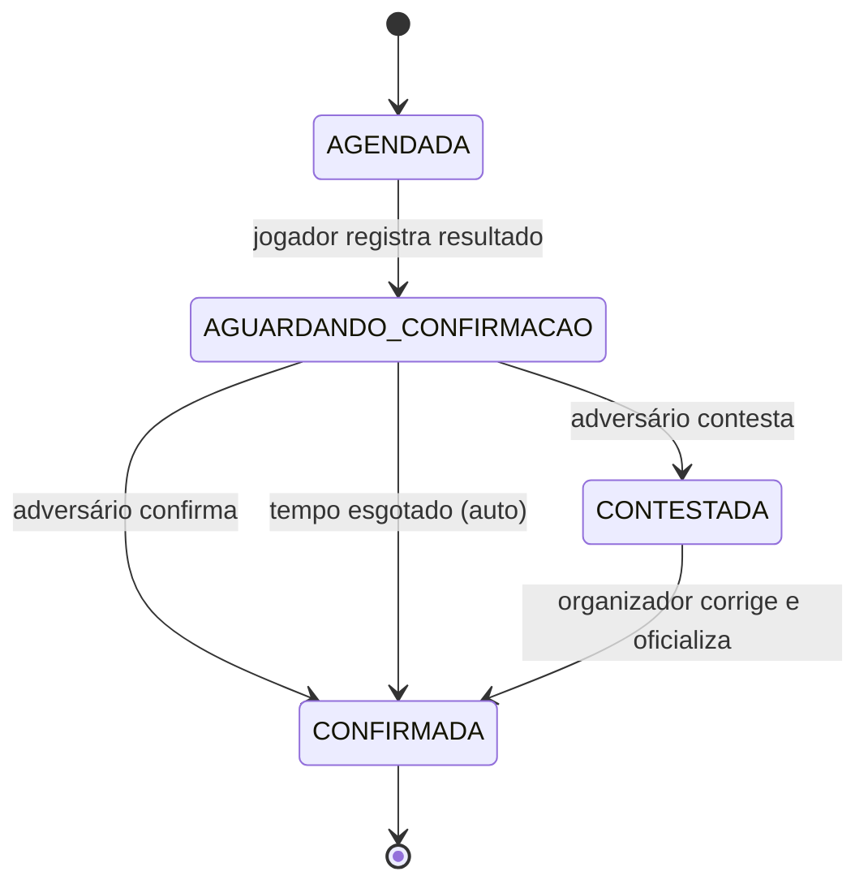

# Core Flows — Clandestino

## Visão geral dos fluxos



## Fluxo 1 — Acesso do jogador via QR code

**Descrição:** Jogador entra no torneio escaneando o QR code exibido na academia.

**Entrada:** QR code físico afixado na academia ou exibido pelo organizador.

**Passos:**

1. Jogador escaneia o QR code com a câmera do celular.
2. O navegador abre a página do evento com a lista de participantes inscritos.
3. Jogador localiza e toca no próprio nome.
4. O app exibe um aviso explícito para confirmar que o nome selecionado é o correto para aquela edição.
5. Ao confirmar, o app registra a sessão localmente (sem senha) e redireciona para **Minhas Partidas**.
6. Se o nome não estiver na lista, o jogador vê o torneio em modo público (somente leitura) com a mensagem: *"Seu nome não está na lista. Fale com o organizador."*

**Saída:** Tela "Minhas Partidas" com todas as partidas do jogador e seus status.

```wireframe

<html>
<head>
<style>
  body { font-family: sans-serif; max-width: 390px; margin: 0 auto; background: #f5f5f5; }
  .header { background: #1a1a2e; color: white; padding: 16px; text-align: center; }
  .header small { opacity: 0.7; font-size: 12px; display: block; }
  .list { padding: 12px; }
  .player-item { background: white; border-radius: 8px; padding: 14px 16px; margin-bottom: 8px; display: flex; align-items: center; justify-content: space-between; border: 1px solid #e0e0e0; }
  .player-item:active { background: #f0f0f0; }
  .player-name { font-size: 16px; font-weight: 500; }
  .player-rank { font-size: 12px; color: #888; }
  .seed-badge { background: #ffd700; color: #333; font-size: 10px; font-weight: bold; padding: 2px 6px; border-radius: 10px; }
  .search { width: calc(100% - 24px); margin: 12px; padding: 10px 12px; border: 1px solid #ccc; border-radius: 8px; font-size: 15px; box-sizing: border-box; }
  .notice { background: #fff3cd; border: 1px solid #ffc107; border-radius: 8px; padding: 12px; margin: 12px; font-size: 13px; color: #856404; }
</style>
</head>
<body>
  <div class="header">
    <div style="font-size:18px; font-weight:bold;">🏓 Clandestino</div>
    <small>Edição #42 — 27 jun 2026</small>
    <small>Selecione seu nome para entrar</small>
  </div>
  <input class="search" type="text" placeholder="Buscar seu nome..." data-element-id="search-player" />
  <div class="list">
    <div class="player-item" data-element-id="player-1">
      <div>
        <div class="player-name">Carlos Mendes</div>
        <div class="player-rank">Ranking: 1º — 142 pts</div>
      </div>
      <span class="seed-badge">SEED</span>
    </div>
    <div class="player-item" data-element-id="player-2">
      <div>
        <div class="player-name">Ana Souza</div>
        <div class="player-rank">Ranking: 2º — 128 pts</div>
      </div>
      <span class="seed-badge">SEED</span>
    </div>
    <div class="player-item" data-element-id="player-3">
      <div>
        <div class="player-name">Bruno Lima</div>
        <div class="player-rank">Ranking: 5º — 89 pts</div>
      </div>
    </div>
    <div class="player-item" data-element-id="player-4">
      <div>
        <div class="player-name">Fernanda Costa</div>
        <div class="player-rank">Ranking: 8º — 61 pts</div>
      </div>
    </div>
  </div>
  <div class="notice" data-element-id="not-found-notice">
    Não encontrou seu nome? Fale com o organizador.
  </div>
</body>
</html>
```

## Fluxo 2 — Tela "Minhas Partidas" (jogador)

**Descrição:** Visão central do jogador durante o torneio — todas as suas partidas com status claro.

**Entrada:** Após seleção do nome no fluxo 1.

**Passos:**

1. App exibe lista de partidas do jogador, agrupadas por fase (Grupo A, Fase de Colocação…).
2. Cada partida mostra: adversário, status atual e, se concluída, o placar.
3. Partidas com status `AGUARDANDO_CONFIRMAÇÃO` exibem destaque visual e botão de ação.
4. Partidas `AGENDADAS` exibem botão "Registrar resultado".
5. Jogador pode tocar em qualquer partida para ver detalhes.

```wireframe

<html>
<head>
<style>
  body { font-family: sans-serif; max-width: 390px; margin: 0 auto; background: #f5f5f5; }
  .header { background: #1a1a2e; color: white; padding: 14px 16px; display: flex; align-items: center; justify-content: space-between; }
  .header-title { font-size: 16px; font-weight: bold; }
  .header-sub { font-size: 12px; opacity: 0.7; }
  .phase-label { font-size: 11px; font-weight: bold; color: #666; text-transform: uppercase; padding: 12px 16px 4px; letter-spacing: 0.5px; }
  .match-card { background: white; border-radius: 8px; margin: 6px 12px; padding: 14px; border: 1px solid #e0e0e0; }
  .match-card.pending { border-left: 4px solid #f59e0b; }
  .match-card.confirmed { border-left: 4px solid #22c55e; }
  .match-card.contested { border-left: 4px solid #ef4444; }
  .match-vs { font-size: 15px; font-weight: 600; margin-bottom: 4px; }
  .match-status { font-size: 12px; color: #888; }
  .match-status.warn { color: #d97706; font-weight: 500; }
  .match-status.ok { color: #16a34a; font-weight: 500; }
  .match-status.err { color: #dc2626; font-weight: 500; }
  .btn { display: inline-block; margin-top: 10px; padding: 8px 14px; border-radius: 6px; font-size: 13px; font-weight: 600; border: none; cursor: pointer; }
  .btn-primary { background: #1a1a2e; color: white; }
  .btn-confirm { background: #22c55e; color: white; }
  .btn-contest { background: white; color: #ef4444; border: 1px solid #ef4444; margin-left: 6px; }
  .score { font-size: 18px; font-weight: bold; color: #1a1a2e; margin-top: 4px; }
  .nav { display: flex; background: white; border-top: 1px solid #e0e0e0; position: fixed; bottom: 0; width: 100%; max-width: 390px; }
  .nav-item { flex: 1; text-align: center; padding: 10px 0; font-size: 11px; color: #888; }
  .nav-item.active { color: #1a1a2e; font-weight: bold; }
</style>
</head>
<body>
  <div class="header">
    <div>
      <div class="header-title">🏓 Bruno Lima</div>
      <div class="header-sub">Grupo B · Clandestino #42</div>
    </div>
    <div style="font-size:11px; background:#ffffff22; padding:4px 8px; border-radius:4px;">Grupo B</div>
  </div>

  <div class="phase-label">Fase de Grupos</div>

  <div class="match-card pending" data-element-id="match-pending">
    <div class="match-vs">vs. Fernanda Costa</div>
    <div class="match-status warn">⏳ Aguardando sua confirmação</div>
    <div class="score">1 × 3</div>
    <button class="btn btn-confirm" data-element-id="btn-confirm">Confirmar</button>
    <button class="btn btn-contest" data-element-id="btn-contest">Contestar</button>
  </div>

  <div class="match-card" data-element-id="match-scheduled">
    <div class="match-vs">vs. Carlos Mendes</div>
    <div class="match-status">Agendada</div>
    <button class="btn btn-primary" data-element-id="btn-register">Registrar resultado</button>
  </div>

  <div class="match-card confirmed" data-element-id="match-confirmed">
    <div class="match-vs">vs. Ana Souza</div>
    <div class="match-status ok">✓ Confirmada</div>
    <div class="score">3 × 2</div>
  </div>

  <div style="height: 60px;"></div>
  <div class="nav">
    <div class="nav-item active" data-element-id="nav-matches">Partidas</div>
    <div class="nav-item" data-element-id="nav-group">Meu Grupo</div>
    <div class="nav-item" data-element-id="nav-standings">Classificação</div>
  </div>
</body>
</html>
```

## Fluxo 3 — Registro de resultado

**Descrição:** Jogador informa o placar de uma partida concluída.

**Entrada:** Botão "Registrar resultado" na linha da partida em "Minhas Partidas".

**Passos:**

1. Jogador toca em "Registrar resultado" na partida desejada.
2. App abre tela de registro com os dois jogadores exibidos.
3. Jogador usa botões **+** e **−** para ajustar os sets de cada lado.
4. O app valida o placar em tempo real (ex.: impede 2×2 em melhor de 3; impede totais impossíveis).
5. Jogador toca em "Enviar resultado".
6. Se offline: resultado salvo localmente com status `AGUARDANDO_SINCRONIZAÇÃO`; ícone de fila exibido.
7. Se online: resultado enviado à API; partida passa para `AGUARDANDO_CONFIRMAÇÃO`.
8. App retorna para "Minhas Partidas" com o status atualizado.

```wireframe

<html>
<head>
<style>
  body { font-family: sans-serif; max-width: 390px; margin: 0 auto; background: #f5f5f5; }
  .header { background: #1a1a2e; color: white; padding: 14px 16px; display: flex; align-items: center; gap: 12px; }
  .back { font-size: 20px; cursor: pointer; }
  .header-title { font-size: 16px; font-weight: bold; }
  .card { background: white; border-radius: 12px; margin: 16px 12px; padding: 20px; }
  .match-title { text-align: center; font-size: 13px; color: #888; margin-bottom: 20px; }
  .players { display: flex; align-items: center; justify-content: space-around; }
  .player-col { text-align: center; flex: 1; }
  .player-name { font-size: 14px; font-weight: 600; margin-bottom: 12px; }
  .counter { display: flex; align-items: center; justify-content: center; gap: 16px; }
  .counter-btn { width: 40px; height: 40px; border-radius: 50%; border: 2px solid #1a1a2e; background: white; font-size: 22px; font-weight: bold; cursor: pointer; display: flex; align-items: center; justify-content: center; }
  .counter-val { font-size: 40px; font-weight: bold; color: #1a1a2e; min-width: 40px; text-align: center; }
  .vs { font-size: 18px; color: #ccc; font-weight: bold; padding: 0 8px; margin-top: 20px; }
  .format-info { text-align: center; font-size: 12px; color: #888; margin-top: 16px; }
  .error-msg { background: #fee2e2; color: #dc2626; border-radius: 6px; padding: 10px 12px; margin: 0 12px; font-size: 13px; text-align: center; }
  .btn-submit { display: block; width: calc(100% - 24px); margin: 16px 12px; padding: 14px; background: #1a1a2e; color: white; border: none; border-radius: 8px; font-size: 16px; font-weight: bold; cursor: pointer; }
  .offline-badge { background: #fef3c7; color: #92400e; font-size: 12px; text-align: center; padding: 8px; margin: 0 12px; border-radius: 6px; }
</style>
</head>
<body>
  <div class="header">
    <span class="back" data-element-id="btn-back">←</span>
    <div class="header-title">Registrar Resultado</div>
  </div>

  <div class="card">
    <div class="match-title">Grupo B · Melhor de 3 sets</div>
    <div class="players">
      <div class="player-col">
        <div class="player-name">Bruno Lima</div>
        <div class="counter">
          <button class="counter-btn" data-element-id="btn-minus-a">−</button>
          <div class="counter-val" data-element-id="score-a">2</div>
          <button class="counter-btn" data-element-id="btn-plus-a">+</button>
        </div>
      </div>
      <div class="vs">×</div>
      <div class="player-col">
        <div class="player-name">Carlos Mendes</div>
        <div class="counter">
          <button class="counter-btn" data-element-id="btn-minus-b">−</button>
          <div class="counter-val" data-element-id="score-b">1</div>
          <button class="counter-btn" data-element-id="btn-plus-b">+</button>
        </div>
      </div>
    </div>
    <div class="format-info">Vence quem ganhar 2 sets primeiro</div>
  </div>

  <div class="offline-badge" data-element-id="offline-notice">📶 Sem conexão — resultado será enviado ao reconectar</div>

  <button class="btn-submit" data-element-id="btn-submit">Enviar resultado</button>
</body>
</html>
```

## Fluxo 4 — Confirmação pelo adversário

**Descrição:** Adversário revisa e confirma (ou contesta) o resultado registrado pelo outro jogador.

**Entrada:** Adversário abre o app e vê partida com status `AGUARDANDO_CONFIRMAÇÃO` em destaque.

**Passos:**

1. Adversário abre o app — a partida pendente aparece no topo de "Minhas Partidas" com destaque visual.
2. Adversário vê o placar registrado pelo outro jogador.
3. Duas ações disponíveis: **Confirmar** ou **Contestar**.
4. Se **Confirmar**: partida passa para `CONFIRMADA`; a classificação da fase atual é recalculada imediatamente; o adversário retorna para "Minhas Partidas" com status atualizado.
5. Se **Contestar**: adversário informa brevemente o motivo (campo de texto curto, opcional); partida passa para `CONTESTADA`; organizador recebe alerta no painel.
6. Se o organizador corrigir uma partida contestada, o resultado corrigido já vira oficial e a classificação é recalculada sem nova aprovação dos jogadores.
7. Se o adversário não agir dentro do tempo configurado para a edição, o resultado é aceito automaticamente e passa para `CONFIRMADA`.

**Estados da partida:**



## Fluxo 5 — Sorteio de grupos (organizador)

**Descrição:** Organizador cria a edição semanal, inscreve jogadores e executa o sorteio auditável.

**Entrada:** Organizador acessa o painel via magic link por e-mail.

**Passos:**

1. Organizador cria nova edição (nome, data, regras da rodada — número de grupos, limiar para melhor de 3 e tempo de auto-confirmação, com valor padrão sugerido pelo sistema).
2. A edição usa a tabela de pontuação da temporada ativa; por padrão, o sistema sugere a tabela 1º=200, 2º=180, 3º=160, 4º=140, 5º=100, 6º=90, 7º=80, 8º=70, 9º=50, 10º=45, 11º=40, 12º=35, 13º=20, 14º=15, 15º=10, 16º=5, 17º=4, 18º=3, 19º=2, 20º=1; do 21º lugar em diante, 0 ponto; essa tabela padrão pode ser editada por temporada.
3. Inscreve os participantes da semana (busca por nome no cadastro de jogadores).
4. O sistema identifica automaticamente os seeds com base no ranking acumulado (1 seed por grupo).
5. Organizador revisa a lista de seeds e participantes; pode ajustar o número de grupos se necessário.
6. Toca em **"Executar sorteio"** — o sistema distribui os seeds (1 por grupo) e sorteia os demais aleatoriamente.
7. O sistema registra: algoritmo, versão, semente aleatória, ranking utilizado, data e responsável.
8. Organizador vê a tela de grupos formados. O sorteio é imutável — para alterar, é necessário cancelar e refazer.
9. Organizador toca em **"Gerar partidas"** — todas as partidas da fase de grupos são criadas automaticamente.
10. O QR code da edição fica disponível para exibir aos jogadores.

```wireframe

<html>
<head>
<style>
  body { font-family: sans-serif; max-width: 390px; margin: 0 auto; background: #f5f5f5; }
  .header { background: #1a1a2e; color: white; padding: 14px 16px; }
  .header-title { font-size: 16px; font-weight: bold; }
  .header-sub { font-size: 12px; opacity: 0.7; }
  .section { background: white; border-radius: 8px; margin: 12px; padding: 14px; }
  .section-title { font-size: 13px; font-weight: bold; color: #444; margin-bottom: 10px; text-transform: uppercase; letter-spacing: 0.4px; }
  .group-header { font-size: 14px; font-weight: bold; color: #1a1a2e; margin-bottom: 8px; padding-bottom: 6px; border-bottom: 1px solid #eee; }
  .player-row { display: flex; align-items: center; padding: 6px 0; font-size: 14px; gap: 8px; }
  .seed-dot { width: 8px; height: 8px; background: #ffd700; border-radius: 50%; flex-shrink: 0; }
  .normal-dot { width: 8px; height: 8px; background: #ccc; border-radius: 50%; flex-shrink: 0; }
  .audit-box { background: #f0f4ff; border-radius: 6px; padding: 10px; font-size: 11px; color: #555; line-height: 1.6; }
  .btn { display: block; width: 100%; padding: 14px; border: none; border-radius: 8px; font-size: 15px; font-weight: bold; cursor: pointer; margin-top: 8px; }
  .btn-primary { background: #1a1a2e; color: white; }
  .btn-danger { background: white; color: #dc2626; border: 1px solid #dc2626; }
  .qr-placeholder { width: 100px; height: 100px; background: #e0e0e0; border-radius: 8px; margin: 0 auto; display: flex; align-items: center; justify-content: center; font-size: 11px; color: #888; }
</style>
</head>
<body>
  <div class="header">
    <div class="header-title">Clandestino #42 — Grupos</div>
    <div class="header-sub">Sorteio realizado · 27 jun 2026 · 09:14</div>
  </div>

  <div class="section">
    <div class="group-header">Grupo A</div>
    <div class="player-row"><span class="seed-dot"></span> Carlos Mendes <span style="font-size:10px;color:#888;margin-left:auto;">SEED</span></div>
    <div class="player-row"><span class="normal-dot"></span> Rodrigo Alves</div>
    <div class="player-row"><span class="normal-dot"></span> Patrícia Nunes</div>
    <div class="player-row"><span class="normal-dot"></span> Marcos Teixeira</div>
  </div>

  <div class="section">
    <div class="group-header">Grupo B</div>
    <div class="player-row"><span class="seed-dot"></span> Ana Souza <span style="font-size:10px;color:#888;margin-left:auto;">SEED</span></div>
    <div class="player-row"><span class="normal-dot"></span> Bruno Lima</div>
    <div class="player-row"><span class="normal-dot"></span> Fernanda Costa</div>
    <div class="player-row"><span class="normal-dot"></span> Diego Ramos</div>
  </div>

  <div class="section">
    <div class="section-title">Auditoria do sorteio</div>
    <div class="audit-box">
      Algoritmo: snake-seeding v1.2<br>
      Semente: 0xA3F7C2<br>
      Ranking: snapshot #42<br>
      Responsável: Org. João
    </div>
  </div>

  <div class="section" style="text-align:center;">
    <div class="section-title">QR Code da Edição</div>
    <div class="qr-placeholder" data-element-id="qr-code">QR Code</div>
    <div style="font-size:12px;color:#888;margin-top:8px;">Exiba para os jogadores entrarem</div>
  </div>

  <div style="padding: 0 12px 20px;">
    <button class="btn btn-primary" data-element-id="btn-generate-matches">Gerar partidas</button>
    <button class="btn btn-danger" data-element-id="btn-cancel-draw">Cancelar sorteio e refazer</button>
  </div>
</body>
</html>
```

## Fluxo 6 — Geração e publicação da fase de colocação

**Descrição:** Quando a fase de grupos termina, o sistema gera automaticamente a próxima fase e o organizador apenas publica.

**Entrada:** Todas as partidas da fase de grupos estão `CONFIRMADAS`.

**Passos:**

1. Assim que a última partida de grupos é confirmada, o sistema calcula a classificação de cada grupo.
2. O sistema gera automaticamente a fase de colocação conforme a regra da edição: round-robin quando houver 3 ou mais classificados da mesma posição; mata-mata quando houver 2.
3. Organizador recebe a fase pronta para revisão, com os confrontos ou grupos de colocação já montados.
4. Organizador toca em **"Publicar fase de colocação"**.
5. Jogadores passam a ver as novas partidas em **Minhas Partidas**.
6. A tela pública muda para exibir a fase atual e seus novos confrontos e classificação ao vivo.

```wireframe
<!DOCTYPE html>
<html>
<head>
<style>
  body { font-family: sans-serif; max-width: 390px; margin: 0 auto; background: #f5f5f5; }
  .header { background: #1a1a2e; color: white; padding: 14px 16px; }
  .header-title { font-size: 16px; font-weight: bold; }
  .header-sub { font-size: 12px; opacity: 0.7; }
  .section { background: white; border-radius: 8px; margin: 12px; padding: 14px; }
  .section-title { font-size: 13px; font-weight: bold; color: #444; margin-bottom: 10px; text-transform: uppercase; }
  .group-box { border: 1px solid #e5e7eb; border-radius: 8px; padding: 10px; margin-bottom: 10px; }
  .group-name { font-size: 14px; font-weight: bold; color: #1a1a2e; margin-bottom: 6px; }
  .player-row { font-size: 14px; padding: 4px 0; }
  .btn { display: block; width: calc(100% - 24px); margin: 12px; padding: 14px; border: none; border-radius: 8px; font-size: 15px; font-weight: bold; cursor: pointer; }
  .btn-primary { background: #1a1a2e; color: white; }
</style>
</head>
<body>
  <div class="header">
    <div class="header-title">Fase de Colocação Pronta</div>
    <div class="header-sub">Revise e publique a próxima fase</div>
  </div>

  <div class="section">
    <div class="section-title">Disputa 1º ao 3º</div>
    <div class="group-box">
      <div class="group-name">Grupo de Colocação A</div>
      <div class="player-row">1º Grupo A — Carlos Mendes</div>
      <div class="player-row">1º Grupo B — Ana Souza</div>
      <div class="player-row">1º Grupo C — Bruno Lima</div>
    </div>
  </div>

  <div class="section">
    <div class="section-title">Disputa 4º ao 6º</div>
    <div class="group-box">
      <div class="group-name">Grupo de Colocação B</div>
      <div class="player-row">2º Grupo A — Fernanda Costa</div>
      <div class="player-row">2º Grupo B — Diego Ramos</div>
      <div class="player-row">2º Grupo C — Patrícia Nunes</div>
    </div>
  </div>

  <button class="btn btn-primary" data-element-id="btn-publish-placement">Publicar fase de colocação</button>
</body>
</html>
```

## Fluxo 7 — Tela pública (sem login)

**Descrição:** Qualquer pessoa acessa a URL do torneio e acompanha em tempo real, sem autenticação.

**Entrada:** URL direta do torneio (sem QR code de jogador).

**Passos:**

1. Usuário acessa a URL — vê uma lista geral única de todos os jogadores na fase atual em tempo real, mesmo durante a fase de grupos.
2. Pode navegar entre abas: **Classificação**, **Grupos**, **Partidas**.
3. Resultados e classificações atualizam automaticamente via SSE (sem necessidade de recarregar).
4. Um botão fixo no topo oferece: *"Sou jogador — entrar com QR code"*.
5. Nenhuma ação de escrita está disponível — somente leitura.

```wireframe

<html>
<head>
<style>
  body { font-family: sans-serif; max-width: 390px; margin: 0 auto; background: #f5f5f5; }
  .header { background: #1a1a2e; color: white; padding: 14px 16px; }
  .header-title { font-size: 18px; font-weight: bold; }
  .header-sub { font-size: 12px; opacity: 0.7; }
  .live-badge { display: inline-block; background: #ef4444; color: white; font-size: 10px; font-weight: bold; padding: 2px 6px; border-radius: 10px; margin-left: 8px; vertical-align: middle; }
  .qr-btn { display: block; margin: 12px; padding: 12px; background: white; border: 2px dashed #1a1a2e; border-radius: 8px; text-align: center; font-size: 14px; font-weight: 600; color: #1a1a2e; cursor: pointer; }
  .tabs { display: flex; background: white; border-bottom: 1px solid #e0e0e0; }
  .tab { flex: 1; text-align: center; padding: 12px 0; font-size: 13px; color: #888; cursor: pointer; }
  .tab.active { color: #1a1a2e; font-weight: bold; border-bottom: 2px solid #1a1a2e; }
  .table { background: white; margin: 12px; border-radius: 8px; overflow: hidden; }
  .table-header { display: flex; padding: 8px 12px; font-size: 11px; font-weight: bold; color: #888; text-transform: uppercase; border-bottom: 1px solid #eee; }
  .table-row { display: flex; align-items: center; padding: 12px; border-bottom: 1px solid #f0f0f0; font-size: 14px; }
  .table-row:last-child { border-bottom: none; }
  .pos { width: 28px; font-weight: bold; color: #1a1a2e; }
  .name { flex: 1; }
  .pts { width: 40px; text-align: right; font-weight: 600; }
  .detail { font-size: 11px; color: #888; }
  .gold { color: #d97706; }
  .silver { color: #6b7280; }
  .bronze { color: #92400e; }
</style>
</head>
<body>
  <div class="header">
    <div class="header-title">🏓 Clandestino #42 <span class="live-badge">AO VIVO</span></div>
    <div class="header-sub">27 jun 2026 · Fase de Grupos</div>
  </div>

  <div class="qr-btn" data-element-id="btn-player-login">📷 Sou jogador — entrar com QR code</div>

  <div class="tabs">
    <div class="tab active" data-element-id="tab-standings">Classificação</div>
    <div class="tab" data-element-id="tab-groups">Grupos</div>
    <div class="tab" data-element-id="tab-matches">Partidas</div>
  </div>

  <div class="table">
    <div class="table-header">
      <div class="pos">#</div>
      <div class="name">Jogador</div>
      <div class="pts">Sets</div>
    </div>
    <div class="table-row">
      <div class="pos gold">1</div>
      <div class="name">Carlos Mendes <div class="detail">Grupo A · 3 partidas</div></div>
      <div class="pts">9</div>
    </div>
    <div class="table-row">
      <div class="pos silver">2</div>
      <div class="name">Ana Souza <div class="detail">Grupo B · 3 partidas</div></div>
      <div class="pts">8</div>
    </div>
    <div class="table-row">
      <div class="pos bronze">3</div>
      <div class="name">Bruno Lima <div class="detail">Grupo B · 2 partidas</div></div>
      <div class="pts">6</div>
    </div>
    <div class="table-row">
      <div class="pos">4</div>
      <div class="name">Fernanda Costa <div class="detail">Grupo A · 2 partidas</div></div>
      <div class="pts">5</div>
    </div>
  </div>
</body>
</html>
```

## Resumo dos estados de partida

| Status | Quem age | Próximo estado |
| --- | --- | --- |
| `AGENDADA` | Qualquer jogador da partida | `AGUARDANDO_CONFIRMAÇÃO` |
| `AGUARDANDO_CONFIRMAÇÃO` | Adversário confirma | `CONFIRMADA` |
| `AGUARDANDO_CONFIRMAÇÃO` | Adversário contesta | `CONTESTADA` |
| `AGUARDANDO_CONFIRMAÇÃO` | Tempo esgotado | `CONFIRMADA` (auto) |
| `CONTESTADA` | Organizador corrige e oficializa | `CONFIRMADA` |
